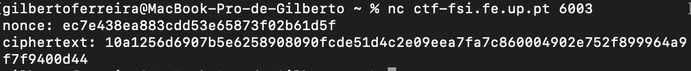
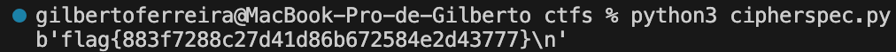

# CTF Weak-Encryption

In this challenge our objective was to decrypt an encrypted message given the ciphertext and the nonce value used to encrypt the message.

## Information gathering

To solve this CTF we started by analysing the code in the file `cipherspec.py` that is comprised of the following three functions:

- `gen()`: generates a symmetric key to be used for the encryption and decryption of a message. The key is built by adding `13` '\x00\ bytes to `3` bytes with random values. This detail will be important later;
- `enc(k, m, nonce)`: encrypts a message `m` using key `k` and a nonce value `nonce` (the initial value of the counter in CTR encryption) with a AES algorithm in CTR mode;
- `dec(k, c, nonce)`: decrypts a message `m` using key `k` and a nonce value `nonce` with the same algorithms used in the function to encrypt the message;

After that, in a terminal, we used the command `nc ctf-fsi.fe.up.pt 6003` that gave us the nonce "ec7e438ea883cdd53e65873f02b61d5f" and ciphertext "10a1256d6907b5e6258908090fcde51d4c2e09eea7fa7c860004902e752f899964a9f7f9400d44". 



To decrypt this encrypted message we just need to figure out the key that was used to encrypt the original message. With that we can use that key, the ciphertext and the nonce value as input to the `dec(k, c, nonce)` function to retrieve the flag.

While we were analysing the code in the `cipherspec.py` file, we noticed that the way the key is generated isn't very safe. Since only `3` of the `16` bytes are random (we know that the firsr `13` bytes are '\x00') there are only 256^3 = 16777216 possible keys that can be generated to encrypt the message (each byte has 8 bits which can represent 256 different numbers), which means we can simply try all possible keys until one of them gives us the flag!

## The attack

To use the `enc(k, m, nonce)` and `dec(k, m, nonce)` functions we need to use bytearrays as the key, message and nonce values. To convert the ciphertext and nonce values that are given to us to bytearrays we can use the function unhexlify from the binascii module. For example to encrypt and decrypt the message "Hello World!" we can run the following commands:

```python
print(enc(bytes([0]*16), binascii.unhexlify("48656c6c6f20576f726c6421"), bytes([0] * 16))) # b".\x8c'\xb8\x80\xaa{T\xfa \x9ex"
print(enc(bytes([0]*16), b".\x8c'\xb8\x80\xaa{T\xfa \x9ex", bytes([0] * 16))) # b'Hello World!'
```

To get the flag we iterated through every possible key and tried to decrypt the ciphertext with it. If the decrypted message started with the characters `flag{` (the first characters of the flag of the challenge) we know we have found the flag. The script used to attack the vulnerablity is the following:

```python
for i in range(256):
	for j in range(256):
		for k in range(256):
			plaintext = dec(bytes([0]*13 + [i, j, k]), binascii.unhexlify("10a1256d6907b5e6258908090fcde51d4c2e09eea7fa7c860004902e752f899964a9f7f9400d44"), binascii.unhexlify("ec7e438ea883cdd53e65873f02b61d5f"))
			if (plaintext[0:5] == b'flag{'):
				print (plaintext)
```

The script took 3m42s to run and gave us the flag:

