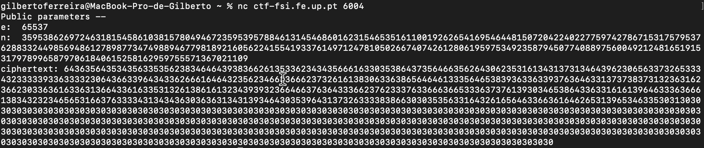
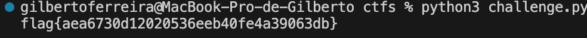

# CTF RSA

In this challenge our objective was to decrypt a message encrypted by RSA given its ciphertext, and the public key (the pair consisting of the public exponent `e` and modulus `n`)



## Information gathering

To solve this CTF we were given the information that the primes `p` and `q` used to generate the public and private keys are close to the number `2^512` and `2^513` respectively.

To begin this challenge we started by analysing the code given to us in the file `challenge.py`. In this file we have access to the functions `enc(x, e, n)` and `dec(y, d, n)`:

- `enc(x, e, n)`: encrypts a message `x` using RSA with the public key, that is, the public exponent `e` and modulus `n`. The new and encrypted message is equal to `x^e (mod n)`, which in our case is the `ciphertext` that is given to us;

- `dec(y, d, n)`: decrypts an encrypted message `y` using RSA, with the private key, that is, the private exponent `d` and modulus `n`. The decrypted message is equal to `y^d (mod n)`.

To decrypt the message that is given to us we need to find out the value of the private exponent `d` and use the function `dec` to decrypt the message that is given to us.

From the theoretical knowledge of the RSA algorithm we know the following facts:

1. `n = p * q`: the modulus `n` is generated by multiplying two prime numbers `p` and `q`;
2. `φ(n) = (p - 1)(q - 1)`: the Euler's totient function of `n` is equal to the multiplication of `p - 1` with `q - 1`;
3. `e * d ≡ 1 (mod φ(n))`: the private exponent `d` is the multiplicative inverse of the public exponent `e` modulo `φ(n)`.

That is, if we can find out the primes `p` and `q` used to generate the modulus `n` then we can find the value `d` using the public exponent `e` and the value `φ(n)` with expression number `3.` above. There is only one pair (p, q) so that `n = p * q` since `p` and `q` are prime numbers, that is, there is `no other` possible factorization of `n` other than `p * q`.

## The attack
To find the primes `p` and `q` we firstly wrote a function in python that implements the `Miller-Rabin probabilistic primality test`, which determines if a given number is likely to be prime:

```python
def miller_rabin(num, k):
    if num == 2 or num == 3:
        return True
    
    if num % 2 == 0:
        return False

    exponent = 0
    factor = num - 1
    
    while(factor % 2 == 0):
        exponent += 1
        factor //= 2
    
    for i in range (k):
        a = randint(2, num - 2)
        x = pow(2, factor, num)
        for j in range(exponent):
            y = (x*x) % num
            if y == 1 and x != 1 and x != num - 1:
                return False
            x = y
        if y != 1:
            return False
    return True

print(miller_rabin(103, 10)) # True
print(miller_rabin(104, 10)) # False
```

Since we know that the primes `p` and `q` are close to the number `2^512` and `2^513` respectively we determined a certain window, for example, `10` and traversed the ranges `p = [2^512 - 5, 2^512 + 5]` and `q = [2^513 - 5, 2^513 + 5]` to find two primes `p` and `q` which multiplied resulted in the value `n`. If two primes verify this result we are sure we have found the correct primes since there is no other pair of numbers `(a, b)` different from the pair `(p, q)` that multiplied result in `n`.

With that we wrote the following lines of python to find the primes `p` and `q` and, with them, discover the private exponent `d` and decrypt our ciphertext with it. For the attack to work we used the interval `1500` and got the flag:

```python
e = 65537
n = 359538626972463181545861038157804946723595395788461314546860162315465351611001926265416954644815072042240227759742786715317579537628833244985694861278987734749889467798189216056224155419337614971247810502667407426128061959753492358794507740889756004921248165191531797899658797061840615258162959755571367021109
ciphertext = '6436356435343563353562383464643938366261353362343435666163303538643735646635626430623531613431373134643962306563373265333432333339336333323064366339643433626661646432356234663366623732616138306336386564646133356465383936336339376364633137373837313236316236623033636163363136643361633531326138616132343939323664663763643336623762333763366636653336373761393034653864336331616139646333636661383432323465653166376333343134343630363631343139346430353964313732633338386630303535633164326165646336636164626531396534633530313030303030303030303030303030303030303030303030303030303030303030303030303030303030303030303030303030303030303030303030303030303030303030303030303030303030303030303030303030303030303030303030303030303030303030303030303030303030303030303030303030303030303030303030303030303030303030303030303030303030303030303030303030303030303030303030303030303030303030303030303030303030303030303030303030303030303030303030303030303030303030303030303030303030303030303030303030303030303030303030303030303030303030303030303030'

interval = 2000
midp = pow(2, 512)
midq = pow(2, 513)
accuracy = 10

for p in range(midp - interval//2, midp + interval//2 + 1):
    if not miller_rabin(p, accuracy):
        continue
    for q in range(midq - interval, midq + interval + 1):
        if not miller_rabin(q, accuracy):
            continue
        if p * q == n:
            totient = (p - 1) * (q - 1)
            d = pow(e, -1, totient)
            print(dec(unhexlify(ciphertext), d, n).decode())
```

