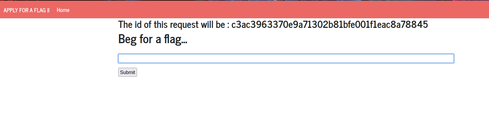
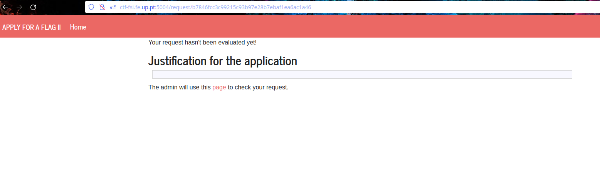
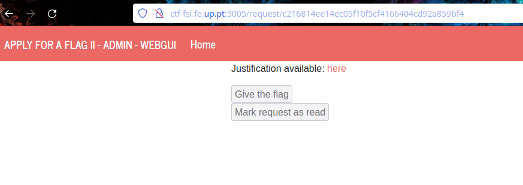
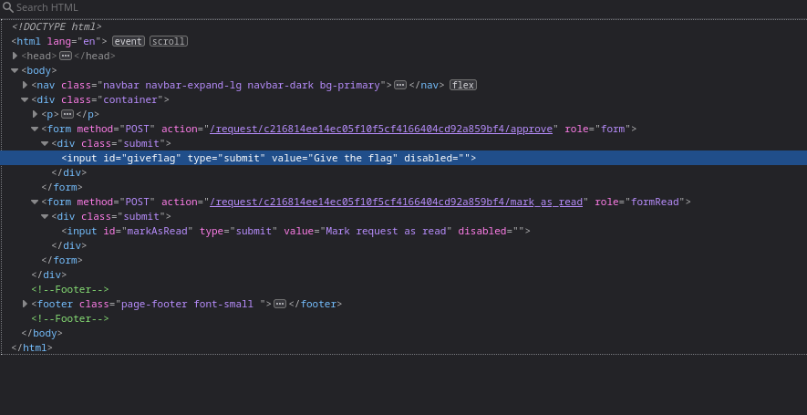
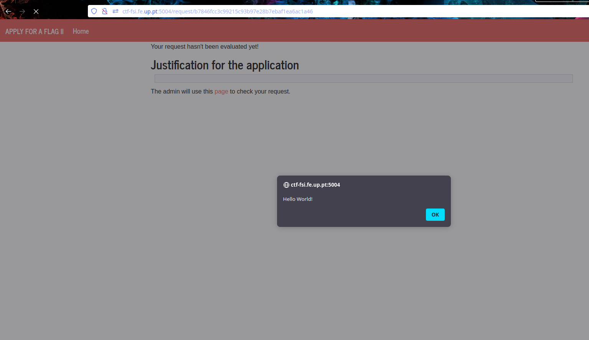
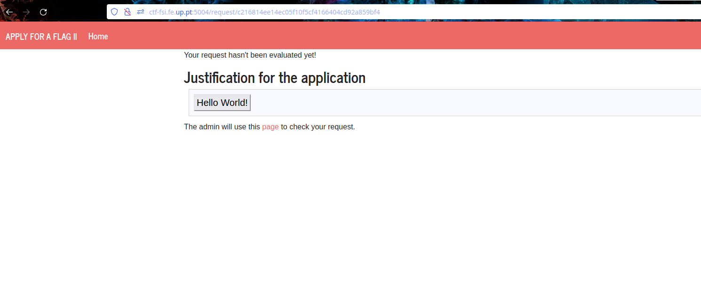
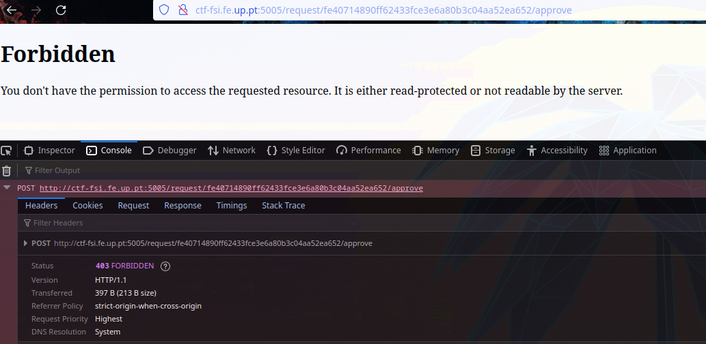
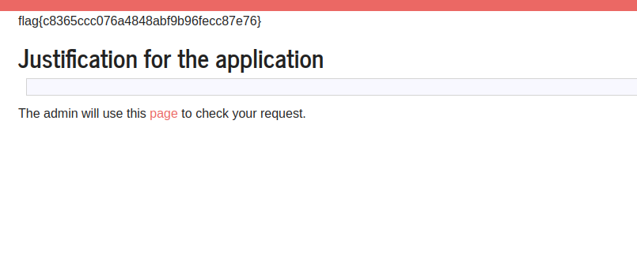

## Information Gathering

In tackling this challenge, our primary focus was to initially gather information about the target website. Starting our exploration on the homepage, we encountered a message revealing the ID of our next request, alongside a box allowing input for flag requests. 




 Upon submitting a test request with "Hello World!", we were redirected to another page displaying three key elements: the ID of our request, the submitted request itself, and a link.

 


By clicking the link we enter a new page with an administrator's view and two disable buttons one labeled “Give the flag” and the other one labeled “Mark request as read”. 

 

We also noticed that this page was on port 5005 instead of the usual 5004.
Recognising the potential significance of the "Give the flag" button on the admin page, we dived into the page's source code to analyse it. 
By doing so, we discovered that the button triggers a form submission to the URL "http://ctf-fsi.fe.up.pt:5005/request/fe40714890ff62433fce3e6a80b3c04aa52ea652/approve," we realised that manipulating this process could lead us to the flag. we could force the system administrator to make this request with our specific request ID.

 

Given the nature of this challenge involving Cross-Site Scripting (XSS), we conducted experiments by inputting 

```js
<script> alert('Hello World!'); </script>
```

 and

```html
<button> Hello World! </button>
```

 on the homepage. This served to verify if arbitrary JavaScript code and HTML could be executed. Our theory was proved correct as the first input triggered an alert, and the second rendered a button labelled "Hello World!" upon redirection to the page displaying our request .

  



## The Attack

To implement this attack, we put our theoretical knowledge into practise. In our first try we start by using the following code as input on the homepage:

```html
<form method="POST" action="http://ctf-fsi.fe.up.pt:5005/request/fe40714890ff62433fce3e6a80b3c04aa52ea652/approve">      
</form>

<script> document.forms[0].submit() </script>
```

This code constructs a form with the desired action, with the aim of forcing the administrator to execute http://ctf-fsi.fe.up.pt:5005/request/our_request_id/approve , and  granting us the flag. Additionally, a JavaScript script is used to submit the first form.

 

Unfortunately, this initial code failed, as it was also executed within our user context. Consequently, we were redirected to an error page displaying 'FORBIDDEN,' indicating insufficient privileges for such a request as a normal user. This issue was linked to the Same-Origin Policy (SOP). Although SOP permits requests from port 5004 to 5005, it restricts the reception of responses, leading to a 'forbidden' error.

To address this, we made a simple modification to the code by adding the attribute target='_blank.' 

```html
<form method="POST" action="http://ctf-fsi.fe.up.pt:5005/request/fe40714890ff62433fce3e6a80b3c04aa52ea652/approve" target="_blank">     
</form>
<script> document.forms[0].submit() </script>
```

This ensured that the response to this request is displayed in a new browsing context, thus avoiding redirection to the error page. By doing so, we managed to overcome the SOP restriction and obtain the desired response, even though it is not conventionally allowed by SOP.

Furthermore, it's crucial to highlight that the administrator needs to execute our request to determine if the flag will be granted to the user. However, the user will never directly receive a response; attempts will result in a 'forbidden' error. By running the request, the administrator unintentionally accepts it, enabling us to obtain the desired flag.


This adjustment successfully prevented redirection to the error page, enabling us to obtain the flag: flag{39ecb5b4ca1818831f4cd8cb0b95818a}!

 

