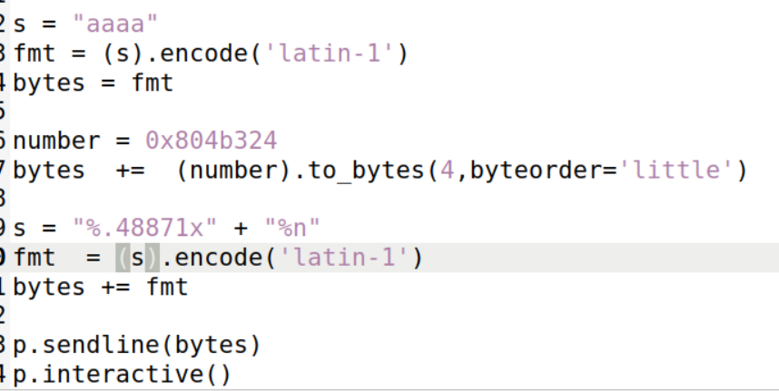

# CTF Format Strings

## Challenge 1

The challenge began with an analysis of the program's security properties using the `checksec` command. By doing that we found that:

- The program uses a little-endian 32-bit architecture,
- The program contains the presence of stack canaries,
- The program uses Partial RELRO implementation,
- The program has non-executable stack enabled,
- The program does not use Position Independent Executable (PIE).


### Code Analysis and Vulnerability Identification

The program, implemented in C, involved loading a flag into a global buffer and subsequently asking the user for an input that is later printed using printf.

```c
char flag[FLAG_BUFFER_SIZE];

void load_flag(){
    FILE *fd = fopen("flag.txt","r");

    if(fd != NULL) {
        fgets(flag, FLAG_BUFFER_SIZE, fd);
    }
}

int main() {
load_flag();
   
    char buffer[32];

    printf("Try to unlock the flag.\n");
    printf("Show me what you got:");
    fflush(stdout);
    scanf("%32s", &buffer);
    printf("You gave me this: ");
    printf(buffer);

    // rest of the code
```

Upon analyzing the code, we observed that the user's input size was restricted to match the buffer size, eliminating the possibility of a buffer overflow attack. However, a significant vulnerability persisted. The printf function responsible for printing the user's input had only one argument, creating an opportunity for exploiting string formatting. This could force the program to print the contents of the buffer, revealing us the flag.

### Exploitation Strategy

With a clear understanding of the vulnerability, we start the exploitation process. The first step involved running the program locally with `gdb` to obtain the address of the buffer containing the flag.


Note that this only works due to the absence of PIE allowed which gives a consistent buffer address, simplifying the exploitation process. 
After that  a Python script was created to construct the desired input.


The script starts to append the buffer address where the flag is contained to the beginning of the string, followed by '%s'. Note that the address is sent in the reversed order due to the architecture being little-endian.
This formatting trick makes the printf function interpret the '%s' as a placeholder for a string argument, that results in the printf printing the string stored in the address located at the beginning of the stack. This address would normally be the address given to the printf in the second argument, however, as there is no second argument, the value of the string address will be the value of the first four bytes of our input, in our case the address of the buffer containing the flag.

This attack worked flawlessly giving us the flag.


## Challenge 2: 

Before starting the second challenge we ran `checksec` once again and got the following results:


The only difference from the first challenge is that there is no RELRO this time. That is, this program is still vulnerable to a format string attack.

### Code Analysis and Vulnerability Identification

In this second challenge the vulnerable line is the 15th line `printf(buffer)`, because buffer holds the input the user gives to the program and it is being used directly as the sole argument to `printf`. This results in a format string vulnerability that lets us read or write to an arbitrary address in memory.

In this challenge, to have access to the flag, we will need to overwrite the value of the variable `key` to `0xbeef` so that we have access to a shell as we can see in the code below:

```c
if(key == 0xbeef) {
    printf("Backdoor activated\n");
    fflush(stdout);
    system("/bin/bash");    
} else {
    printf("\n\n\nWrong key: %d\n", key);
    fflush(stdout);
}
```

With that shell we will be able to run the command `cat flag.txt` since we know that's the file where the flag is.

### The attack

To change the value of the variable key we firstly checked the address of the variable `key` with `gdb`:


We also ensured that printf starts reading the contents of the buffer immediately after the first "%.8x" format specifier, as we did in the first challenge.

The attack consisted in using the string `aaaa`, followed by the address of the variable `key` and finishing with `%.48871x%n` as the input to the program, which was build with the following python script:



Note that the machine is little-endian and because of that the address of the variable is stored in reverse order.

Here is why this input works:

1. Firstly `printf` will print `aaaa` and the four characters that correspond to these ascii values in the hexadecimal format: `24`, `b3`, `04` and `08`, that is, our address divided in bytes in reverse order. This prints eight characters although some of them aren't visible or don't make sense.


2. After that we used the format specifier `%.48871x` to read the first four bytes that come in the stack (the beginning of our string), that is, we read the characters `aaaa`. However this specific format specifier prints this four characters with a padding of 48871, which effectively writes 48871 characters;

3. Finally we use the format specifier `%n`. This will read the next four bytes in the stack, which will be the address of the value `key` and overwrite the value in that address with the number of characters that have been written until now. Since we have printed 8 + 48871 = 48879 characters the value `0xbeef` will be written in the address of the variable `key`, because the decimal value of `0xbeef` is 48879.

This updates the value of `key` to the desired value and gives us a shell:


With this, we simply ran the commands `ls` to check that the file with the flag was in the current directory and `cat flag.txt` to get the flag:

