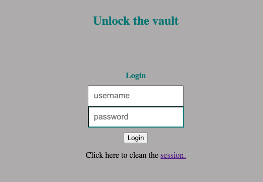
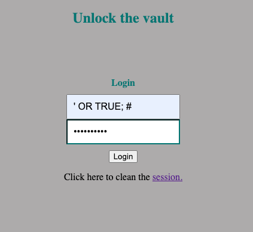
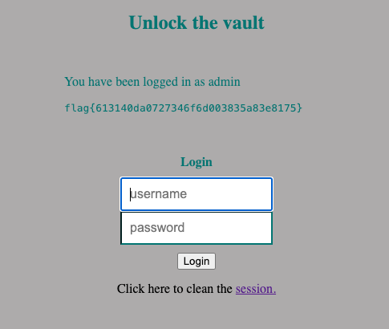

# CTF SQL Injection

## Information gathering

When we access the website used for this challenge we encounter a login form that requests for a username and a password. Our goal is to get logged in as any user, since the flag is given to any user that is authenticated.



We started by analysing the php code that was given to us and took note of the following:

1. The program doesn’t sanitize our input and doesn’t use prepared statements, that is, our input is directly injected in the query that is going to be used;

2. The query that we build must be successful so that the method `query` from php doesn’t return false. If it isn't we get an error and don’t have access to the flag;

3. The query has to return at least one valid result so that the flag in printed to us.

The relevant part of code that allows us to make the points above is the following (we need at least one username to be returned so that the code in the `while` loop runs):

```php
$username = $_POST['username'];
$password = $_POST['password'];

$query = "SELECT username FROM user WHERE username = '".$username."' AND password = '".$password."'";
                        
if ($result = $conn->query($query)) {
                    
    while ($data = $result->fetchArray(SQLITE3_ASSOC)) {
    $_SESSION['username'] = $data['username'];

    echo "<p>You have been logged in as {$_SESSION['username']}</p><code>";
    include "/flag.txt";
    echo "</code>";

    }
} else {            
    // falhou o login
    echo "<p>Invalid username or password <a href=\"index.php\">Tente novamente</a></p>";
}
```

Knowing this, we have to manipulate the query so that it returns the information of at least one user.

## The attack

The following query is executed in each login attempt:

```sql
SELECT username FROM user WHERE username = '".$username."' AND password = '".$password."';
```

To attack this program we used the following input:

- Username = `' OR TRUE; #`
- Password = `godpacheco`



Here is why this input works:

1. We started with the character `'` in our username field to cancel the other `'` character immediately before the variable `$username`. With this we have the following query `SELECT username FROM user WHERE username = ''`;

2. We follow that with `OR TRUE` so that the condition in the WHERE clause always returns TRUE, that is, our query is now `SELECT username FROM user WHERE username = '' OR TRUE`, which returns the username of `every` user in the system's database;

3. We end our username input with `; #` to finish the query and comment the rest of the query `' AND password = '".$password."';`. Because of that the final query is `SELECT username FROM user WHERE username = '' OR TRUE; #`;

4. With this the value inserted in the password field can be anything but the empty string, since the password input defined in HTML has the attribute `required` set.

Using the input above authenticates us as admin and gives us the flag:

