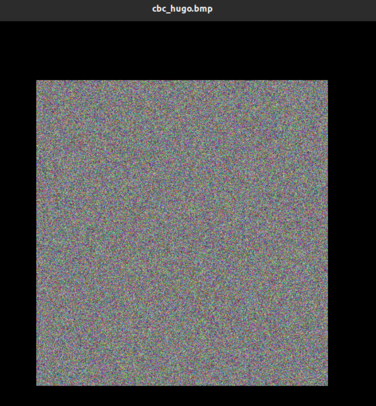

# Secret Key Encryption Lab

Para este lab, começámos por compreender cada um dos ficheiros que existiam no diretório do lab. Entre eles os mais importantes: 

- cyphertext.txt: ficheiro que contém o texto cifrado, que será decifrado na primeira tarefa.
- freq.py: ficheiro que contém o código python que nos permite calcular a frequência de cada letra no texto cifrado.
- pic_original.bmp: imagem original que será cifrada na terceira tarefa.
- words.txt: ficheiro que contém uma lista de palavras em inglês, que será usada na segunda task.

### Task 1: Frequency Analysis

Nesta tarefa, o objetivo é decifrar o texto cifrado presente no ficheiro cyphertext.txt. Para tal, começámos por correr o ficheiro freq.py, que nos devolveu a frequência de cada letra no texto cifrado. Depois, procuramos na wikipedia a frequência de cada letra na língua inglesa, e comparamos com a frequência de cada letra no texto cifrado. Com isto, conseguimos perceber que as letras mais frequentes no texto cifrado são o `N`, o `Y` e o `V`, que correspondem às letras `E`, `T` e `A` na língua inglesa. 

Para substituir as letras no texto cifrado usamos o comando `tr` do linux que nos permite substituir caracteres: 
```bash
tr 'nyv' 'ETA' < cyphertext.txt > out.txt 
``` 

Com isto, obtemos o texto decifrado, que é o seguinte: 

```
TtE xqaAhq Tzhu  xu qzupAd ltmat qEEcq AgxzT hmrtT AbTEh Ttmq ixur qThAurE
AlAhpq Thme TtE gArrEh bEEiq imsE A uxuArEuAhmAu Txx

TtE AlAhpq hAaE lAq gxxsEupEp gd TtE pEcmqE xb tAhfEd lEmuqTEmu AT mTq xzTqET
Aup TtE AeeAhEuT mceixqmxu xb tmq bmic axceAud AT TtE Eup Aup mT lAq qtAeEp gd
TtE EcEhrEuaE xb cETxx TmcEq ze giAasrxlu eximTmaq AhcaAupd AaTmfmqc Aup
A uATmxuAi axufEhqATmxu Aq ghmEb Aup cAp Aq A bEfEh phEAc AgxzT ltETtEh TtEhE
xzrtT Tx gE A ehEqmpEuT lmubhEd TtE qEAqxu pmpuT ozqT qEEc EkThA ixur mT lAq
EkThA ixur gEaAzqE TtE xqaAhq lEhE cxfEp Tx TtE bmhqT lEEsEup mu cAhat Tx
Afxmp axubimaTmur lmTt TtE aixqmur aEhEcxud xb TtE lmuTEh xidcemaq TtAusq
edExuratAur

xuE gmr jzEqTmxu qzhhxzupmur Ttmq dEAhq AaApEcd AlAhpq mq txl xh mb TtE
aEhEcxud lmii ApphEqq cETxx EqeEamAiid AbTEh TtE rxipEu rixgEq ltmat gEaAcE
A ozgmiAuT axcmurxzT eAhTd bxh TmcEq ze TtE cxfEcEuT qeEAhtEApEp gd 
exlEhbzi txiidlxxp lxcEu ltx tEieEp hAmqE cmiimxuq xb pxiiAhq Tx bmrtT qEkzAi
tAhAqqcEuT Ahxzup TtE axzuThd

[...]
```

Após esta troca decidimos passar aos 3-gramas, que são conjuntos de 3 letras. Para tal, corremos o seguinte código: 

Através delas deduzimos que poderíamos fazer as substituições seguintes:

- `t` para `H`
- `u` para `N`
- `p` para `D`
- `m` para `I`
- `r` para `G`

Após voltar a substituir, notamos algumas possíveis palavras a serem formadas trocando letras, o que nos levou a conseguir decifrar o texto: 

- X -> O: vimos a palavra xN e já tínhamos o I subsituido, por isso tentamos O e verificamos a partir da percentagem.
- Q -> S  e H -> R: a partir das palavras qThANGE e THIq. 
- Z -> U: A partir da palavra TzRN
- G -> B: A partir da palavra AgOzT 
- B -> F: A partir da palavra AbTER
- I -> L: A partir da palavra iONG
- D -> Y: A partir da palavra SUNDAd
- S -> K: A partir da palavra LIsE
- C -> M: A partir das palavras SEEcS e DEcISE
- A -> C: A partir da palavra OSaARS
- L -> W: A partir das palavras AlARDS e lAS
- K -> X: A partir da palavra EkTRA
- F -> V: A partir do nome HARfEY(Harvey) WEINSTEIN
- E -> P: A partir das palavras AeeARENT e IMeLOSION
- J -> Q: A partir da palavra jUESTION
- W -> Z: A partir da palavra PRIwE
- O -> J: A partir da palavra oUBILANT

Assim, no final, corremos a seguinte linha de código para substituir as letras no texto cifrado: 


No final, conseguimos perceber que o texto decifrado no ficheiro out.txt é o seguinte: 

```
THE OSCARS TURN  ON SUNDAY WHICH SEEMS ABOUT RIGHT AFTER THIS LONG STRANGE
AWARDS TRIP THE BAGGER FEELS LIKE A NONAGENARIAN TOO

THE AWARDS RACE WAS BOOKENDED BY THE DEMISE OF HARVEY WEINSTEIN AT ITS OUTSET
AND THE APPARENT IMPLOSION OF HIS FILM COMPANY AT THE END AND IT WAS SHAPED BY
THE EMERGENCE OF METOO TIMES UP BLACKGOWN POLITICS ARMCANDY ACTIVISM AND
A NATIONAL CONVERSATION AS BRIEF AND MAD AS A FEVER DREAM ABOUT WHETHER THERE
OUGHT TO BE A PRESIDENT WINFREY THE SEASON DIDNT JUST SEEM EXTRA LONG IT WAS
EXTRA LONG BECAUSE THE OSCARS WERE MOVED TO THE FIRST WEEKEND IN MARCH TO
AVOID CONFLICTING WITH THE CLOSING CEREMONY OF THE WINTER OLYMPICS THANKS
PYEONGCHANG

ONE BIG QUESTION SURROUNDING THIS YEARS ACADEMY AWARDS IS HOW OR IF THE
CEREMONY WILL ADDRESS METOO ESPECIALLY AFTER THE GOLDEN GLOBES WHICH BECAME
A JUBILANT COMINGOUT PARTY FOR TIMES UP THE MOVEMENT SPEARHEADED BY 
POWERFUL HOLLYWOOD WOMEN WHO HELPED RAISE MILLIONS OF DOLLARS TO FIGHT SEXUAL
HARASSMENT AROUND THE COUNTRY

SIGNALING THEIR SUPPORT GOLDEN GLOBES ATTENDEES SWATHED THEMSELVES IN BLACK
SPORTED LAPEL PINS AND SOUNDED OFF ABOUT SEXIST POWER IMBALANCES FROM THE RED
CARPET AND THE STAGE ON THE AIR E WAS CALLED OUT ABOUT PAY INEQUITY AFTER
ITS FORMER ANCHOR CATT SADLER QUIT ONCE SHE LEARNED THAT SHE WAS MAKING FAR
LESS THAN A MALE COHOST AND DURING THE CEREMONY NATALIE PORTMAN TOOK A BLUNT
AND SATISFYING DIG AT THE ALLMALE ROSTER OF NOMINATED DIRECTORS HOW COULD
THAT BE TOPPED

AS IT TURNS OUT AT LEAST IN TERMS OF THE OSCARS IT PROBABLY WONT BE

WOMEN INVOLVED IN TIMES UP SAID THAT ALTHOUGH THE GLOBES SIGNIFIED THE
INITIATIVES LAUNCH THEY NEVER INTENDED IT TO BE JUST AN AWARDS SEASON
CAMPAIGN OR ONE THAT BECAME ASSOCIATED ONLY WITH REDCARPET ACTIONS INSTEAD
A SPOKESWOMAN SAID THE GROUP IS WORKING BEHIND CLOSED DOORS AND HAS SINCE
AMASSED  MILLION FOR ITS LEGAL DEFENSE FUND WHICH AFTER THE GLOBES WAS
FLOODED WITH THOUSANDS OF DONATIONS OF  OR LESS FROM PEOPLE IN SOME 
COUNTRIES


NO CALL TO WEAR BLACK GOWNS WENT OUT IN ADVANCE OF THE OSCARS THOUGH THE
MOVEMENT WILL ALMOST CERTAINLY BE REFERENCED BEFORE AND DURING THE CEREMONY 
ESPECIALLY SINCE VOCAL METOO SUPPORTERS LIKE ASHLEY JUDD LAURA DERN AND
NICOLE KIDMAN ARE SCHEDULED PRESENTERS

ANOTHER FEATURE OF THIS SEASON NO ONE REALLY KNOWS WHO IS GOING TO WIN BEST
PICTURE ARGUABLY THIS HAPPENS A LOT OF THE TIME INARGUABLY THE NAILBITER
NARRATIVE ONLY SERVES THE AWARDS HYPE MACHINE BUT OFTEN THE PEOPLE FORECASTING
THE RACE SOCALLED OSCAROLOGISTS CAN MAKE ONLY EDUCATED GUESSES

THE WAY THE ACADEMY TABULATES THE BIG WINNER DOESNT HELP IN EVERY OTHER
CATEGORY THE NOMINEE WITH THE MOST VOTES WINS BUT IN THE BEST PICTURE
CATEGORY VOTERS ARE ASKED TO LIST THEIR TOP MOVIES IN PREFERENTIAL ORDER IF A
MOVIE GETS MORE THAN  PERCENT OF THE FIRSTPLACE VOTES IT WINS WHEN NO
MOVIE MANAGES THAT THE ONE WITH THE FEWEST FIRSTPLACE VOTES IS ELIMINATED AND
ITS VOTES ARE REDISTRIBUTED TO THE MOVIES THAT GARNERED THE ELIMINATED BALLOTS
SECONDPLACE VOTES AND THIS CONTINUES UNTIL A WINNER EMERGES

IT IS ALL TERRIBLY CONFUSING BUT APPARENTLY THE CONSENSUS FAVORITE COMES OUT
AHEAD IN THE END THIS MEANS THAT ENDOFSEASON AWARDS CHATTER INVARIABLY
INVOLVES TORTURED SPECULATION ABOUT WHICH FILM WOULD MOST LIKELY BE VOTERS
SECOND OR THIRD FAVORITE AND THEN EQUALLY TORTURED CONCLUSIONS ABOUT WHICH
FILM MIGHT PREVAIL

IN  IT WAS A TOSSUP BETWEEN BOYHOOD AND THE EVENTUAL WINNER BIRDMAN
IN  WITH LOTS OF EXPERTS BETTING ON THE REVENANT OR THE BIG SHORT THE
PRIZE WENT TO SPOTLIGHT LAST YEAR NEARLY ALL THE FORECASTERS DECLARED LA
LA LAND THE PRESUMPTIVE WINNER AND FOR TWO AND A HALF MINUTES THEY WERE
CORRECT BEFORE AN ENVELOPE SNAFU WAS REVEALED AND THE RIGHTFUL WINNER
MOONLIGHT WAS CROWNED

THIS YEAR AWARDS WATCHERS ARE UNEQUALLY DIVIDED BETWEEN THREE BILLBOARDS
OUTSIDE EBBING MISSOURI THE FAVORITE AND THE SHAPE OF WATER WHICH IS
THE BAGGERS PREDICTION WITH A FEW FORECASTING A HAIL MARY WIN FOR GET OUT

BUT ALL OF THOSE FILMS HAVE HISTORICAL OSCARVOTING PATTERNS AGAINST THEM THE
SHAPE OF WATER HAS  NOMINATIONS MORE THAN ANY OTHER FILM AND WAS ALSO
NAMED THE YEARS BEST BY THE PRODUCERS AND DIRECTORS GUILDS YET IT WAS NOT
NOMINATED FOR A SCREEN ACTORS GUILD AWARD FOR BEST ENSEMBLE AND NO FILM HAS
WON BEST PICTURE WITHOUT PREVIOUSLY LANDING AT LEAST THE ACTORS NOMINATION
SINCE BRAVEHEART IN  THIS YEAR THE BEST ENSEMBLE SAG ENDED UP GOING TO
THREE BILLBOARDS WHICH IS SIGNIFICANT BECAUSE ACTORS MAKE UP THE ACADEMYS
LARGEST BRANCH THAT FILM WHILE DIVISIVE ALSO WON THE BEST DRAMA GOLDEN GLOBE
AND THE BAFTA BUT ITS FILMMAKER MARTIN MCDONAGH WAS NOT NOMINATED FOR BEST
DIRECTOR AND APART FROM ARGO MOVIES THAT LAND BEST PICTURE WITHOUT ALSO
EARNING BEST DIRECTOR NOMINATIONS ARE FEW AND FAR BETWEEN
```

---

### Task 2: Encryption using Different Ciphers and Modes

Para esta tarefa foi-nos pedido para encriptar o ficheiro words.txt usando diferentes cifras e modos. Para tal, começámos por correr o comando `openssl enc -aes-128-cbc -e -in words.txt -out aescbc.txt -K 00112233445566778889aabbccddeeff -iv 0102030405060708`. Com isto, conseguimos encriptar o ficheiro words.txt usando o algoritmo AES-128 no modo CBC.


Depois, corremos o comando `openssl enc -aes-128-cfb -e -in words.txt -out aescfb.txt -K 00112233445566778889aabbccddeeff -iv 0102030405060708`. Com isto, conseguimos encriptar o ficheiro words.txt usando o algoritmo AES-128 no modo CFB.


Por fim, corremos o comando `openssl enc -bf-cbc -e -in words.txt -out bfcfb.txt -K 00112233445566778889aabbccddeeff -iv 0102030405060708`. Com isto, conseguimos encriptar o ficheiro words.txt usando o algoritmo BF no modo CBC.


---

### Task 3: Encryption Mode – ECB vs. CBC

Para esta tarefa, foi-nos pedido para encriptar a imagem pic_original.bmp de modo que não seja possível o que está na imagem original, usando os modos ECB e CBC. Deste modo conseguimos perceber as diferenças entre os dois modos de encriptação.
Assim, para encriptar o ficheiro pic_original.bmp no modo ECB corremos o seguinte código: 


Para além disto, como o ficheiro encriptado é um ficheiro .bmp, temos de manter os primeiros 54 bytes: o `header` do ficheiro, de modo que o ficheiro seja considerado um ficheiro .bmp legítimo. Portanto, foi necessário correr o seguinte código:

```bash
$ head -c 54 pic_original.bmp > header
$ tail -c +55 new_pic_ecb.bmp > body
$ cat header body > newecb.bmp
```

Com isto, conseguimos obter a seguinte imagem:


Podemos verificar que ainda é possível perceber o que está na imagem original, uma vez que o modo ECB encripta cada bloco de 128 bits de forma independente, isto é, sempre com o valor da chave. Assim, como a imagem original tem blocos repetidos, a encriptação de cada um destes blocos dá um mesmo bloco encriptado, e por isso é possível perceber o que está na imagem original. Assim, não foi possível encriptar a imagem de modo que não seja possível perceber o que está na imagem original.

Depois, para encriptar o ficheiro pic_original.bmp no modo CBC corremos o seguinte código:


Uma vez mais, como queremos que o ficheiro seja considerado um ficheiro .bmp legitimo, foi necessário correr o seguinte código:

```bash
$ head -c 54 pic_original.bmp > header
$ tail -c +55 new_pic_cbc.bmp > body
$ cat header body > newecb.bmp
```

Com isto, conseguimos obter a seguinte imagem:


Agora já não é possível perceber o que está na imagem original, uma vez que o modo CBC encripta cada bloco de 128 bits de forma dependente. Assim, mesmo que a imagem original tenha blocos repetidos, estes são encriptados com valores diferentes, e, por isso, não é possível perceber o que está na imagem original. Assim, conseguimos encriptar a imagem de modo que não seja possível perceber o que está na imagem original.

Por último, foi pedido para repetirmos o processo, mas com uma imagem à nossa escolha. Para entender melhor os processos e os resultados, fizemos alguns testes: 

#### Imagem 1


Num primeiro teste, decidimos utilizar uma fotografia do professor, que tem muitos detalhes e cores diferentes. Os resultados obtidos foram os seguintes:

| Imagem ECB | Imagem CBC |
|----------|----------|
|  |  |

Podemos verificar que não há grandes diferenças entre as duas imagens, uma vez que o modo ECB encripta cada bloco de 128 bits de forma independente, e como a imagem tem muitas cores diferentes, há poucos blocos repetidos. Assim, os resultados são praticamente semelhantes.

Portanto, esta imagem não é a melhor para perceber as diferenças entre os dois modos de encriptação.

#### Imagem 2


Num segundo teste, decidimos utilizar uma imagem com cores sólidas, para perceber melhor as diferenças entre os dois modos de encriptação. Para isto usamos uma imagem que construimos rapidamente numa ferramenta online, e foi necessário converter a imagem para o formato .bmp. Os resultados obtidos foram os seguintes:

| Imagem ECB | Imagem CBC |
|----------|----------|
|  |  |

Aqui a nossa conclusão é que o fundo branco não ajudou nos resultados obtidos. No modo ECB, é possível verificar um padrão, que não é possível verificar no modo CBC. Isto acontece porque o modo ECB encripta cada bloco de 128 bits de forma independente, e como a imagem tem cores sólidas, há blocos repetidos. Assim, os resultados são diferentes. No CBC verificamos uma vez mais que não é possível perceber o que está na imagem original, uma vez que o modo CBC encripta cada bloco de 128 bits de forma dependente. Assim, mesmo que a imagem original tenha blocos repetidos, estes são encriptados de forma diferente, e por isso não é possível perceber o que está na imagem original. No entanto, obtivemos em ambas as imagens um fundo preto, que dificulta um pouco a visualização da imagem. 
Assim, decidimos que devíamos fazer uma nova experiência, com uma imagem onde fosse possível perceber melhor as diferenças entre os dois modos de encriptação.

#### Imagem 3


Para esta experiência decidimos usar o tux, que para além de apresentado como exemplo nos slides das teóricas, é uma imagem com cores sólidas, e que permite perceber melhor as diferenças entre os dois modos de encriptação. Os resultados obtidos foram os seguintes:

| Imagem ECB | Imagem CBC |
|----------|----------|
|  |  |

Por fim, obtivemos os resultados que esperávamos. No modo ECB, é possível ver claramente o tux, ainda que com cores diferentes. Entretanto, onde as cores diferem um pouco mais, deixamos de compreender bem a figura. Isto deve-se ao facto do modo ECB encriptar cada cor de forma independente, e onde as cores diferirem muito, iremos obter cores diferentes. No modo CBC, é completamente impossível identificar qualquer tipo de figura. Como no modo CBC cada bloco é combinado com o bloco anterior com um XOR, não é possível perceber o que está na imagem original. 

Assim, concluímos que o modo ECB tem uma maior vulnerabilidade neste tipo de imagens, desde que a imagem tenha blocos idênticos de cores sólidas, já que estas repetições são facilmente identificadas, uma vez que a encriptação resulta em blocos idênticos. 
Por sua vez, o modo CBC apresenta-se mais seguro, uma vez que não é possível perceber o que está na imagem original, mesmo que esta tenha blocos idênticos de cores sólidas, já que a encriptação resulta em blocos diferentes. Entretanto, o modo CBC apresenta-se mais lento, uma vez que cada bloco é combinado com o bloco anterior com um XOR, o que torna o processo mais lento. 