# Public-Key Infrastructure (PKI) 

The focus on understanding how Public-Key Infrastructure works and how they help to protect the web showing how they defeat Man-in-the-middle (MITM) attacks as well as how MITM attacks can overturn this protections with a compromised private key

## Lab Setup

Before diving into the experiments, we set up a Docker container and configured the Domain Name System (DNS).

### Container Setup

We began by using the `dcbuild` and `dcup` commands to create and launch the Docker container. After identifying the container ID with `dockps`, we accessed the container shell using `docksh 5be384933f01`.

### DNS Setup

After configuring the Docker container, we turned our attention to the DNS. This involved simply adding lines like `10.9.0.80 www.bank32.com` and `10.9.0.80 www.pacheco2023.com` to the `/etc/hosts` file, setting up the necessary domain associations for our experiments.


## Task 1 - Becoming a Certificate Authority (CA)

To start this task we firstly configured the `openssl.conf` file as described in the guide so that we could use OpenSSL to create certificates. After that we ran the following command to create a Certificate Authority:

```bash
openssl req -x509 -newkey rsa:4096 -sha256 -days 3650 \
-keyout ca.key -out ca.crt \
-subj "/CN=www.modelCA.com/O=Model CA LTD./C=US" \
-passout pass:dees
```

Following that we inspected the contents of the files `ca.crt` (the certificate that binds a public key to a certain entity, in the case `www.modelCA.com`) and `ca.key` (a file that contains the information necessary to create the pair of public and private keys of the entity). With that we answered the questions below:

1. What part of the certificate indicates this is a CA's certificate?<br>
R.: Under the `X509v3 extensions` field there is one field named `X509v3 Basic Constraints` that holds the value `CA:TRUE`<br>


2. What part of the certificate indicates this is a self-signed certificate?<br>
R.: We can check that information in the lines `Issuer` and `Subject`, since the issuer (the entity is signing a certificate for itself).<br>


3. In the RSA algorithm, we have a public exponent e, a private exponent d, a modulus n, and two secret numbers p and q, such that n = pq. Please identify the values for these elements in your certificate and key files.<br>
R.: In the certificate file `ca.crt` we have the value `modulus n` in the field `Modulus` and the `public exponent e` in the field `Exponent`. These values are the public key of the entity. In the key file `ca.key` we have the values necessary to build the public and private keys, that is, the valyes `modulus n`, `exponents e and d` and the `primes p and q` in the fields `modulus`, `publicExponent`, `privateExponent`, `prime1` and `prime2` respectively.<br>


## Task 2 - Generating a Certificate Request for Your Web Server

To generate a certificate request for our webserver `www.pacheco2023.com` we ran the following command (as instructed in the guide):

```bash
openssl req -newkey rsa:2048 -sha256 \
-keyout server.key -out server.csr \
-subj "/CN=www.pacheco2023.com/O=pacheco2023 Inc./C=US" \
-passout pass:dees \
```

That generated the pair of public and private keys for our entity and the files `server.csr` (certificate signing request with the public key) and `server.key` (private key file).

In addition to that we also estalished two alternative names to the certificate signing request `www.pacheco2023A.com` and `www.pacheco2023B.com` with the following command (essentially giving us a new certificate signing request):

```bash
openssl req -newkey rsa:2048 -sha256 \
-keyout server.key -out server.csr \
-subj "/CN=www.pacheco2023.com/O=pacheco2023 Inc./C=US" \
-passout pass:dees \
-addext "subjectAltName =   DNS:www.pacheco2023.com, \
                            DNS:www.pacheco2023A.com, \
                            DNS:www.pacheco2023B.com"
```


## Task 3 - Generating a Certificate for your server

In this task we simply uncommented the line `copy_extensions = copy` in the OpenSSL configuration file `openssl.conf` and ran the following command to sign the cerficate of `www.pacheco2023.com` with the Certificate Authority that we created in Task 1:

```bash
openssl ca -config myCA_openssl.cnf -policy policy_anything \
-md sha256 -days 3650 \
-in server.csr -out server.crt -batch \
-cert ca.crt -keyfile ca.key
```

This created the file `server.crt` where we can see that the Issuer of the certificate is the Certificate Authority that we created `www.modelCA.com` and the Subject is `www.pacheco2023.com`, that means that this certificate is not self-signed.


## Task 4 - Deploying a a Certificato on an Apache-Based HTTPS Website

The objective of this task is to establish an HTTPS website using Apache to better understand the use of public-key certificates for web security.

To accomplish this, we went to the `/etc/apache2/` directory within the container and utilized the existing setup of the HTTPS site, `www.bank32.com`, as a template for our own. A new file, `pacheco2023_apache_ssl.conf`, was created in the site-available directory, containing the code necessary to configure our website (https://www.pacheco2023.com).

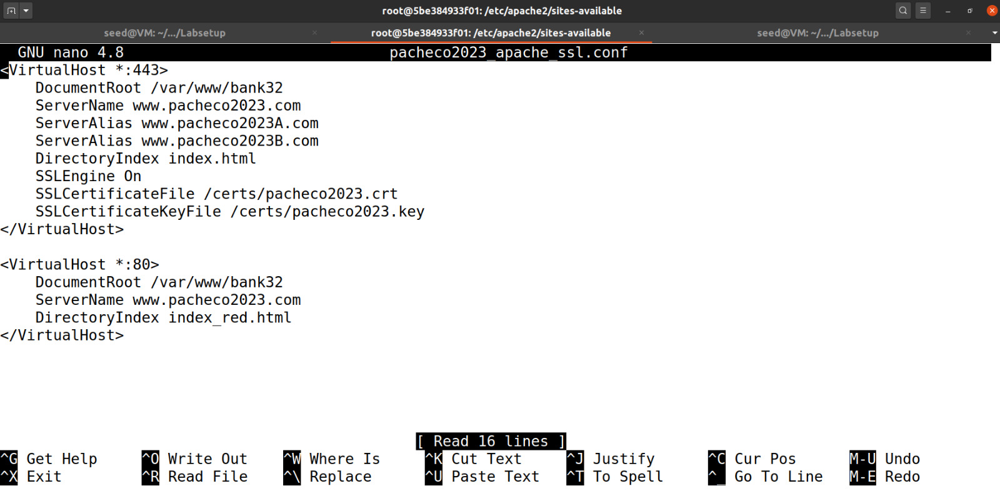

Note that we used the HTML from the bank website. 

After that, we copied the public key and certificate obtained in tasks 2 and 3 to the `/certs` directory, naming them `pacheco2023.key` and `pacheco2023.crt`, respectively. These files will serve as the key and certificate for our website.

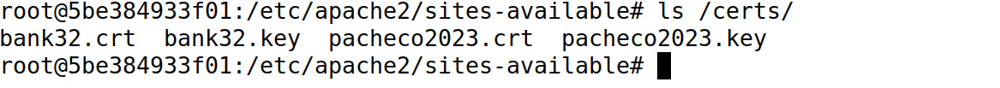


Once that was done we executed `a2ensite pacheco2023_apache_ssl` to enable our website, followed by `service apache2 start` to launch the server. However, upon accessing the website at `https://www.pacheco2023.com`, the browser raised a security warning.

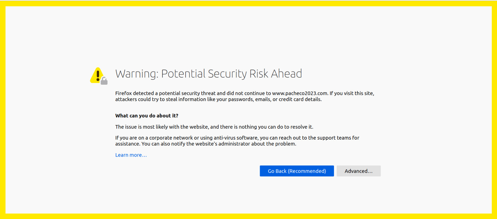


This warning happens due to the browser's unfamiliarity with the Certificate Authority (CA) we created and used to sign the certificate. To address this, we imported our CA into the browser. In Firefox, this was achieved by navigating to `about:preferences#privacy`, clicking "View Certificates," and selecting the import button.

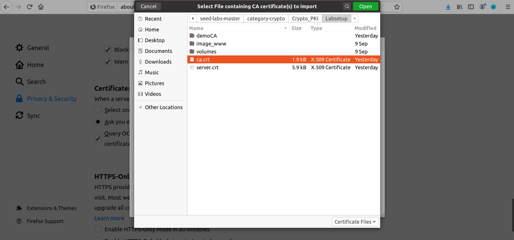

Once completed, accessing the website no longer triggers any security warnings.

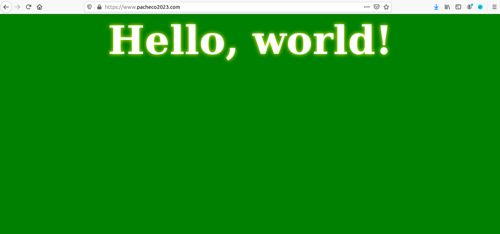

## Task 5 - Launching a Man-In-The-Middle Attack

The aim of this task is to simulate a Man-In-The-Middle (MITM) attack and observe how PKI can counter such threats.

To simulate the attack, we created a fake website using the configuration of `www.bank32.com` and changed the ServerName to `www.example.com`.

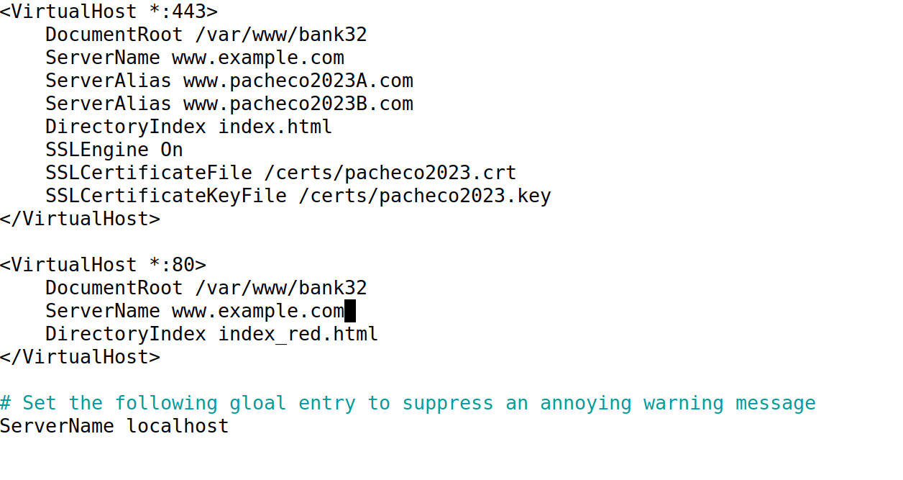

Subsequently, we simulated a DNS attack by adding `10.9.0.80 www.example.com` to the `/etc/hosts` file, redirecting users from the intended site to our site.

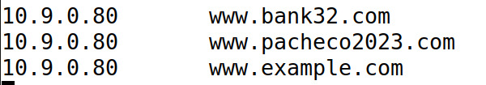

After reloading and restarting Apache, attempting to access `www.example.com` triggers a browser warning due to the absence of a CA that has signed the certificate signing request for our forged website.

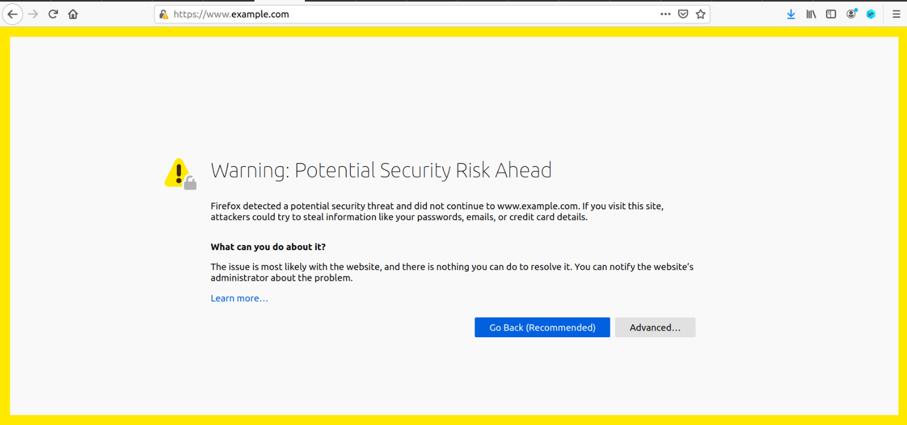

## Task 6 - Launching a Man-In-The-Middle Attack with a Compromised CA

The goal of this task is to simulate a MITM attack with access to a compromised CA private key.

To achieve this, we repeated tasks 2 and 3, generating a key and certificate for the website `www.example.com`

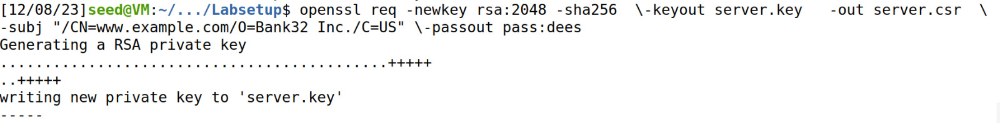
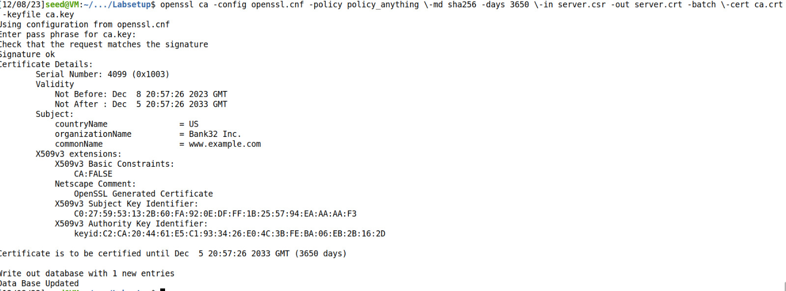

Once that was finished we simply replaced the files `/certs/bank32.key` and `/certs/bank32.crt` with our own key and certificate.

As a result, when accessing the site, the browser no longer raises any warnings, as we now possess a certificate signed by the compromised CA.

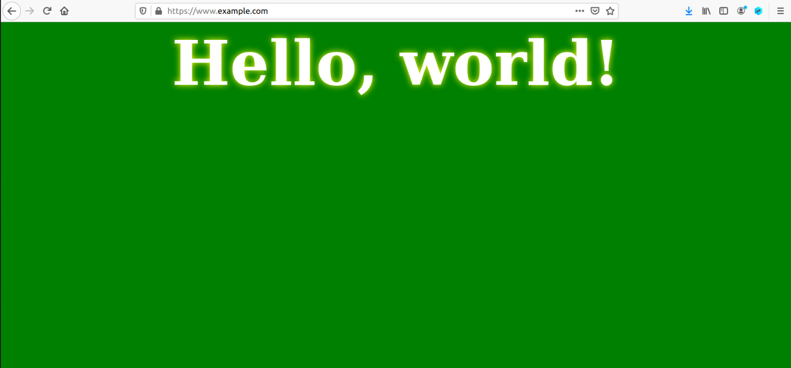
