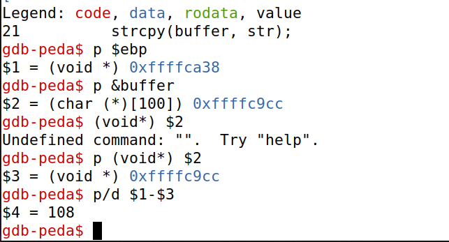
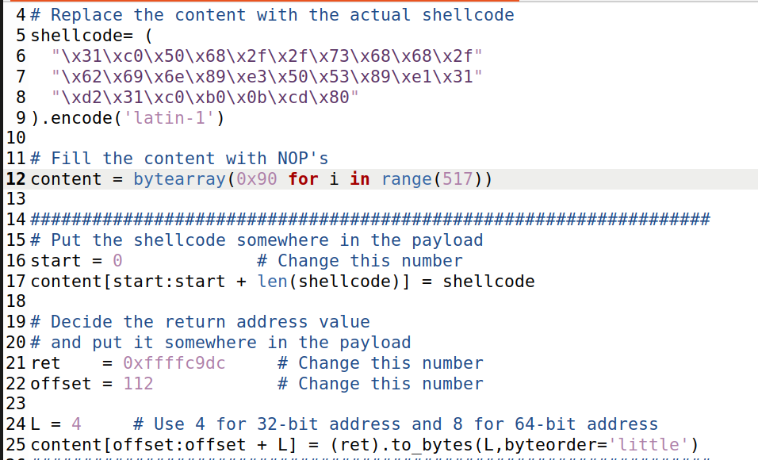
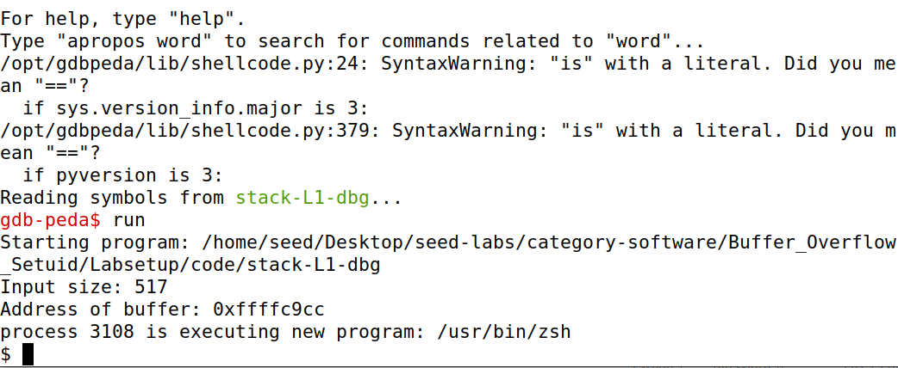

# Buffer-Overflow Attack Lab - Set-UID Version

## Task 1

We first followed the indications given in chapters 1 and 2:
- Disabling address space randomization with `sudo sysctl -w kernel.randomize_va_space=0`
- Linking /bin/sh to /bin/zsh that doesn't have the countermeasure that /bin/dash has of immediately changing the effective user ID to the process’s real user ID in a SET-UID process;
 
In this task, we simply read the information given in the guide regarding shellcode written in C and Assembly. As asked in chapter 3.4, we compiled the code given by typing `make` and ran both scripts `a32.out` and `a64.out`. Both scripts gave us access to a (root? verificar isto) shell.

## Task 2

In this task, we studied the vulnerable program `stack.c` and compiled it using `make`. After that, we checked that the resulting programs are SET-UID programs that are owned by `root`.

## Task 3
In this task, we exploited the stack-L1-dbg using `gdb`.

### Extracting information
To run the attack we need to know the address of the buffer and the address of the frame pointer (the return address is stored 4 bytes above the frame pointer in 32-bits machines and 8 bytes above in 64-bytes machines) 

We first ran `gdb stack-L1-dbg` to run the program in debug mode with `gdb`.

We ran the following command in order:
- `b bof`: set a breakpoint at function bof;
- `run`: run the program (stopping at bof because of the breakpoint);
- `next`: to have the correct value for the address of the frame pointer as described in the guide;
- `p $ebp`: get the address of the frame pointer;
- `p &buffer`: get the buffer's address;
- `p (void *) $2` (assuming $2 = &buffer and $1 = $ebp): &buffer value is given as a char pointer, and the value of $ebp is given as a void pointer. With this command we type cast &buffer to a void pointer resulting in `$3 = (void *) &buffer`;
- `p/d $1 - $3`: find out the offset in bytes between the base of the buffer and the frame pointer's address.

The values we got are listed in this picture:

With this, we get the information that we need to attack the program.

### Changing the python's script
The python script that is given to us allows us to define the following parameters:

- `shellcode`: here we put the 32-bit shellcode, provided in chapter 3.4, that we want to run in the attack;
- `start`: This value represents the number of bytes that will be written in the buffer before the shellcode, in other words, this value represents the position of the buffer where the shellcode will be inserted.
- `ret`: the absolute address where the shellcode will be inserted;
- `offset`: This value represents the number of bytes that will be written in the buffer before the return address, in other words, this value represents the position of the buffer where the return address will be inserted.

We decided to try `four` different attacks in this task. In all of these attacks we used the 32-bit shellcode and the value of `offset` was set to 112 (108 bytes to reach the frame pointer + 4 bytes because the return address is directly above the frame pointer). The possibilities that we covered are:

- `start` = 0 and `ret` = &buffer: as the first attack we inserted the shellcode at the base of the buffer and the return address is the base of the buffer. This resulted in a successful attack, as the function jumps directly to the location of the shellcode;
- `start` = 200 and `ret` = &buffer + 150: in this second attack we inserted the shellcode over the return address. The python script fills all the bytes with NOP operations (0x90), which do nothing, making the program jump to the next operation directly above (jumps 4 bytes in this case). Although the return address given isn't exactly the address where the shellcode is inserted, this attack still works because the program will encounter NOPs until it reaches the shellcode;
- `start` = 200 and `ret` = &buffer + 204: This attack didn't work because the return address given is higher than the address where we inserted the shell code. This results in the execution of an invalid operation because it starts executing the fourth byte of the shellcode (not executing the entire shellcode);
- `start` = 200 and `ret` = &buffer + 100: this last attack also doesn't work, because, although the program finds NOPs and starts making its way up, it finds the return address that is in the address `&buffer + 112` and interprets those bytes operations, giving an invalid operation error.

Here are two photos of the first attack that was described:

## Task 4

In this task, we had to attack the same program by only knowing the address of the buffer. We also know that the buffer's size is guaranteed to be between 100 and 200. Since we know that the buffer's size is between 100 and 200 and that the address of the frame buffer is a multiple of four there are a limited number of possibilities for the address where the return address is stored. These values are: [112, 116, 120, ..., 208, 212]. To exploit this program we inserted the shellcode above the highest possible address for the return address, that is, we set `start` to 250. After that, we set the value of `ret` to &buffer + 250 to point to the shellcode. Instead of inserting this return address only at the address &buffer + `offset`, we modified the script to insert this value in the list of possible addresses where the return address might be stored [112, 116, ..., 208, 212]. After this, we ran the attack and it worked. We also modified the L2 value in the Makefile to 100 and 200 and tested the attack to see if it worked in the lowest and highest possible values. We ranked both attacks and they also worked.

