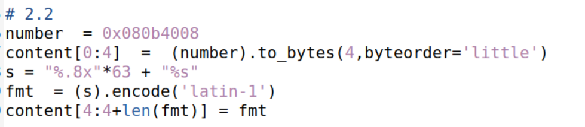

# Format String Attack Lab

Before starting the tasks, we followed the instructions from chapter 2 and analysed the vulnerable program. The program starts by asking  the user for input (with a maximum size of 1500 characters)  and printing it directly using the function `printf`. The user's input is given to `printf` without any additional arguments, resulting in a vulnerability in the program.

 In every task, the unused part of the buffer was filled with the character `\0`, so that the resulting string is as short as possible.

## Task 1: Crashing the Program

Our approach to crashing the program involved providing the string "%s%s%s%s%s"  as input to the `printf` function. 

For each %s, the server will try to read the 32-bit value directly above in the stack and interpret it as a valid address. It will then try to read a string that is stored in that address. If the address that was read isn't a valid address or reads from privileged memory the program will crash. Because of that our input "%s%s%s%s%s" has a high change of crashing the program as this process is potentially repeated five times. The input string doesn't have to be necessarily five consecutive %s but it can have an arbitrary number of "%s" as long as it has the minimum of "%s" characters to crash the program. For example, we tried using the string "%s" but the program exited successfully.

## Task 2: Printing Out the Server Program's Memory

### Task 2.A: Stack Data

To guess how many "%x" format specifiers are needed to get the server program to print out the first four bytes of your input we tried using the the string "++++" concatenated with a string with an arbitrary value of "%.8x" format specifiers. With this string, the buffer will have the characters "++++" in the beginning of the buffer and the "%.8x" characters will read 32-bit values "moving" upwards in the stack and printing them in a hexadecimal format with a padding of 8 characters. All we had to do was try different quantities of "%.8x" characters until our characters ("++++") were the last to be printed by `printf`. We concluded that we needed 63 "%.8x" format specifiers to reach the beginning of the buffer, since the 64th "%.8x" format specifier printed the "++++" string (represented as four "2b", the ascii code for the character '+' in hexadecimal format).

### Task 2 B: Heap Data

To read the address from the secret variable our strategy was to store the address of the secret variable `0x080b4008` in the beginning of the buffer (its address is given to us by the output of the program), use 63 "%.8x" format specifiers to reach the beginning of the buffer and use the format "%s" to read the secret variable address to consequently print its contents. To do so we only had to be careful to store the address in reverse order, that is, instead of using the order "\x08\x0b\x40\x08" we used the order "\x08\x40\x0b\x08", since the server is a small-endian machine. We accomplished the task with the following code that builds the string, resulting in the output of the contents of the secret variable `"A secret message"`.

## Task 3: Modifying the Server Program’s Memory

### Task 3.A: Change the value to a different value

To solve this task, our reasoning was similar to the one used in the previous task. We still stored the address of the target variable `0x080e5068` in reverse order in the beginning of the buffer as described above, followed by 63 "%.8x" format specifiers to reach the beginning of the buffer. However, instead of using the "%s" format specifier, we used the "%n" format specifier. The "%n" format specifier reads a 32-bit value and interprets it as an address (exactly like "%s") and then proceeds to store the number of characters that were already printed in the current `printf` in the address that was read. In this case, before the "%n" format specifier we printed 4 + 8*63 = 508 characters (the 4 characters from the target variable followed by 8 characters for each "%.8x" format specifier) which gives us the value `0x000001fc` as seen below.

### Task 3.B:  Change the value to 0x5000

For this final task we had to change the value of the variable to the specific value `0x5000`. To do so we first calculated how many characters we needed to print before reaching the "%n" format specifier. The value `0x5000` is 20480 in decimal, that is, we need to print 20480 characters before reaching the "%n" format specifier. The beginning of the buffer still needs to hold the address of the target variable in the reverse order, as we did in the previous task, which prints 4 characters. After that, we used 62 "%.8x" format specifiers, which print 496 characters. To print the remaining 20480 - 500 = 19980 characters we used the "%.19980x" format specifier, which prints the value that was read with a padding of 19980 characters. In the end, since we still read 63 values, we reach the beginning of the buffer and use the "%n" format specifier to store the value `0x5000` in the target variable.

